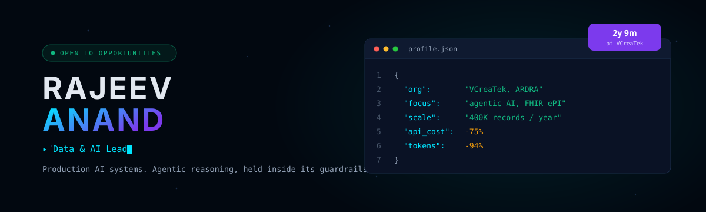
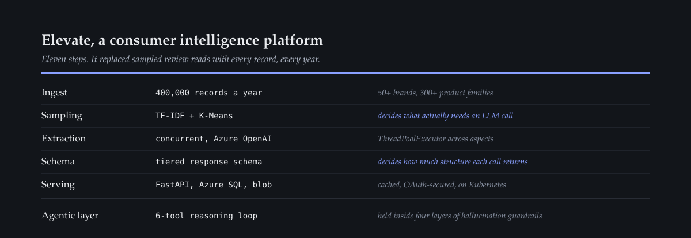
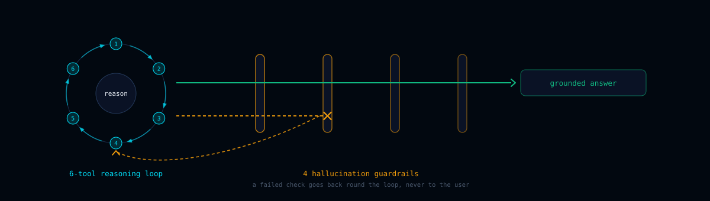

<picture>
  <source media="(prefers-color-scheme: dark)" srcset="assets/banner-dark.svg">
  <source media="(prefers-color-scheme: light)" srcset="assets/banner-light.svg">
  
</picture>

### [→ Full portfolio](https://rajeeva703.pythonanywhere.com/) &nbsp;·&nbsp; [LinkedIn](https://www.linkedin.com/in/rajeev-anand-0304/) &nbsp;·&nbsp; [Credly](https://www.credly.com/users/rajeev-anand.a2c19c5c/badges) &nbsp;·&nbsp; [Writing](https://knottyanand.blogspot.com/) &nbsp;·&nbsp; [Email](mailto:rajeevanand840@gmail.com)

I lead **ARDRA** at VCreaTek — the applied research unit that turns one-off client AI
into reusable production patterns.

---

## Consumer intelligence, at every record

<picture>
  <source media="(prefers-color-scheme: dark)" srcset="assets/pipeline-dark.svg">
  <source media="(prefers-color-scheme: light)" srcset="assets/pipeline-light.svg">
  
</picture>

Two decisions produced the savings: **clustering** picks which records earn an LLM
call, and the **tiered schema** caps how much structure each call returns. Cost at
this scale is an architecture problem, not a prompt problem.

## The agentic layer

<picture>
  <source media="(prefers-color-scheme: dark)" srcset="assets/agentic-dark.svg">
  <source media="(prefers-color-scheme: light)" srcset="assets/agentic-light.svg">
  
</picture>

## Also shipped

| | |
|---|---|
| **ePIL** | Bilingual pharma PDFs → **FHIR R5 XML** bundles for Jordanian regulatory compliance. Azure Document Intelligence + GPT-4.1, English and Arabic, automated QC reporting. |
| **Sango Sathi** | Government-commissioned chatbot scaled to all of **Khunti district, Jharkhand** — AI deployed at rural district scale. |

## Stack

| | |
|---|---|
| **Core** | Python · SQL · FastAPI · Docker · Kubernetes |
| **AI** | Azure OpenAI · agentic architectures · MCP · NLP · scikit-learn |
| **Data** | Databricks · Azure SQL · Azure Blob · pandas |
| **Standards** | FHIR R5 · ePI · OAuth |

## Track

| | |
|---|---|
| **2025 –** | Team Lead, VCreaTek — coordinating ARDRA |
| **2024 –** | Data Scientist, Kenvue (engagement via VCreaTek) |
| **2024 – 25** | Data Engineer, VCreaTek — built the platform core |
| **2022 – 24** | Core Member & Data Lead, askFundu |

MCA, IGNOU · BSc Chemistry. I came to AI from analytical chemistry, which is decent
training in not trusting a result you cannot reproduce.
