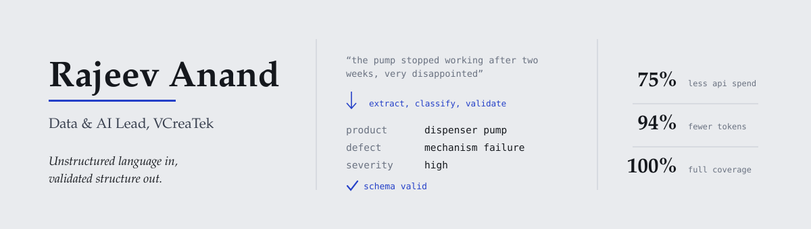
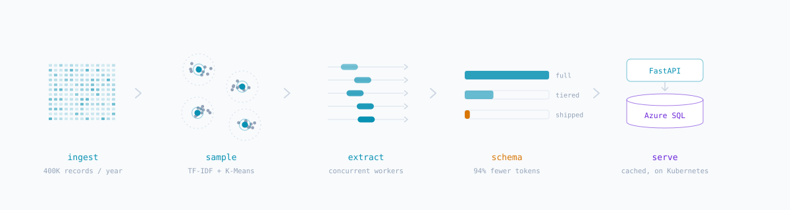

<picture>
  <source media="(prefers-color-scheme: dark)" srcset="assets/banner-dark.svg">
  <source media="(prefers-color-scheme: light)" srcset="assets/banner-light.svg">
  
</picture>

I build AI systems that survive contact with production — agentic reasoning loops that
stay inside their guardrails, regulatory pipelines that pass audit, and cost
architectures that make large-scale LLM work affordable enough to keep running.

Currently **Data & AI Lead at VCreaTek**, coordinating **ARDRA** — our applied
research unit for reimagining enterprise workflows through AI, and for turning
one-off client solutions into reusable production patterns.

---

## What I build

**Consumer intelligence at full coverage.**
An 11-step AI/NLP platform for FMCG consumer feedback, processing **400K+ records a
year across 50+ brands and 300+ product families**. It replaced sampled review reads
with 100% coverage. I shaped its agentic evolution: a **6-tool autonomous reasoning
loop** behind **4 layers of hallucination guardrails**, plus the cost architecture —
intelligent routing, caching and templated execution paths — that cut **API spend 75%
and tokens 94%**, which is what made continuous operation viable rather than a pilot.

**Regulatory document AI that has to be right.**
A production pipeline converting bilingual pharmaceutical PDFs into **FHIR R5 XML
bundles** for Jordanian market compliance, on Azure Document Intelligence and GPT-4.1.
An 11-step multilingual processing and QC pipeline across English and Arabic, with
automated validation and HTML QC reporting for regulatory reviewers. In this domain a
plausible-looking wrong answer is the failure mode that matters, so the interesting
engineering is all in validation.

**Conversational AI at rural district scale.**
Sango Sathi — a government-commissioned chatbot built and scaled for the whole of
**Khunti district, Jharkhand**, one of the few AI products deployed at rural district
scale in India. Built while leading data and AI at an early-stage fintech, where the
constraint was never model quality but accessibility.

---

## How the consumer intelligence platform fits together

<picture>
  <source media="(prefers-color-scheme: dark)" srcset="assets/pipeline-dark.svg">
  <source media="(prefers-color-scheme: light)" srcset="assets/pipeline-light.svg">
  
</picture>

The two numbers that matter are downstream of two decisions. **Smart sampling**
(TF-IDF + K-Means) decides what actually needs an LLM call. The **tiered schema**
decides how much structure each call has to return. Concurrency via
`ThreadPoolExecutor` and an Azure Blob → FastAPI → Azure SQL caching layer do the
rest. Cost reduction at this scale is an architecture problem, not a prompt problem.

---

## Stack

| | |
|---|---|
| **Languages** | Python · SQL |
| **AI / ML** | Azure OpenAI · LLM engineering · agentic architectures · MCP · NLP · scikit-learn |
| **Data** | Databricks · Azure SQL · Azure Blob · pandas · TF-IDF / K-Means |
| **Platform** | FastAPI · Kubernetes · Docker · OAuth · Azure Document Intelligence |
| **Standards** | FHIR R5 · ePI |

---

## Background

**Team Lead, VCreaTek** — Oct 2025 to present. Coordinating ARDRA; established the
reusable engineering patterns and cost-efficient LLM pipeline design now standard
across the consulting practice. Promoted in 22 months by owning delivery end to end,
from pipeline design through agentic architecture to client-facing presentation.

**Data Engineer, VCreaTek** — Jan 2024 to Oct 2025. Built the platform's core
processing infrastructure and containerised it for Kubernetes.

**Data Scientist, Kenvue** (client engagement via VCreaTek) — Jul 2024 to present.

**Core Member & Data Lead, askFundu** — Mar 2022 to Jan 2024. Owned the data and AI
stack across fintech and edtech verticals at an early-stage startup.

MCA, IGNOU · BSc Chemistry, Veer Kunwar Singh University · IBM Data Science
Specialization. I came to AI from analytical chemistry, which is a decent training in
not trusting a result you cannot reproduce.

---

## Elsewhere

[LinkedIn](https://www.linkedin.com/in/rajeev-anand-0304/) ·
[Credly badges](https://www.credly.com/users/rajeev-anand.a2c19c5c/badges) ·
[HackerRank](https://www.hackerrank.com/rajeevanand840) ·
[Writing](https://knottyanand.blogspot.com/) ·
[rajeevanand840@gmail.com](mailto:rajeevanand840@gmail.com)
