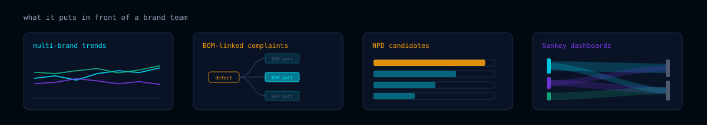
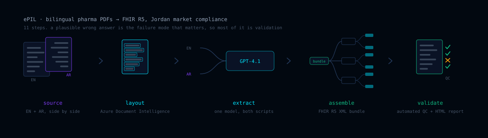
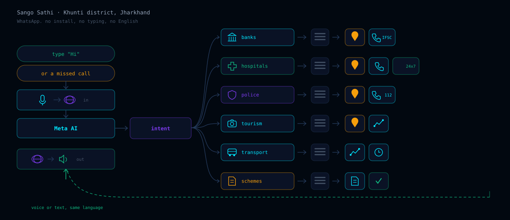

<picture>
  <source media="(prefers-color-scheme: dark)" srcset="assets/banner-dark.svg">
  <source media="(prefers-color-scheme: light)" srcset="assets/banner-light.svg">
  
</picture>

### [→ Full portfolio](https://rajeeva703.pythonanywhere.com/) &nbsp;·&nbsp; [LinkedIn](https://www.linkedin.com/in/rajeev-anand-0304/) &nbsp;·&nbsp; [Credly](https://www.credly.com/users/rajeev-anand.a2c19c5c/badges) &nbsp;·&nbsp; [Writing](https://knottyanand.blogspot.com/) &nbsp;·&nbsp; [Email](mailto:rajeevanand840@gmail.com)

I lead **ARDRA** at VCreaTek — the applied research unit that turns one-off client AI
into reusable production patterns. Three systems below are the ones I'd want judged.

---

# Elevate

**An FMCG consumer intelligence platform.** 400,000 records a year, 50+ brands,
300+ product families — and the first time all of it was read rather than sampled.

## The pipeline

<picture>
  <source media="(prefers-color-scheme: dark)" srcset="assets/pipeline-dark.svg">
  <source media="(prefers-color-scheme: light)" srcset="assets/pipeline-light.svg">
  
</picture>

Eleven steps. Two of them carry the economics: **clustering** decides which records
earn an LLM call, and the **tiered schema** caps how much structure each call returns.
Together, 75% less API spend and 94% fewer tokens — which is what turned a pilot into
something that runs continuously. Cost at this scale is an architecture problem, not a
prompt problem.

## The agentic layer

<picture>
  <source media="(prefers-color-scheme: dark)" srcset="assets/agentic-dark.svg">
  <source media="(prefers-color-scheme: light)" srcset="assets/agentic-light.svg">
  
</picture>

A brand team asks a question in plain language. Six tools reason over the corpus until
they have an answer, and four guardrail layers stand between that answer and the
person who asked. A failed check sends the answer back round the loop — the one thing
a chatbot over complaint data must never do is sound confident and be wrong.

## What it delivers

<picture>
  <source media="(prefers-color-scheme: dark)" srcset="assets/outputs-dark.svg">
  <source media="(prefers-color-scheme: light)" srcset="assets/outputs-light.svg">
  
</picture>

Trend intelligence across brands, complaints traced through the **bill of materials**
to the part that caused them, ranked candidates for new product development, and
Sankey dashboards for where complaint volume actually flows.

---

# ePIL

**Regulatory document AI, where a plausible wrong answer is the failure mode.**

<picture>
  <source media="(prefers-color-scheme: dark)" srcset="assets/epil-dark.svg">
  <source media="(prefers-color-scheme: light)" srcset="assets/epil-light.svg">
  
</picture>

Bilingual pharmaceutical PDFs become **FHIR R5 XML bundles** for Jordanian market
compliance. English and Arabic in the same pipeline, layout recovered with Azure
Document Intelligence, extraction by GPT-4.1, then eleven steps of processing and QC
with automated validation and an HTML report a regulatory reviewer signs off. Most of
the engineering is in the validation, because the bundle either conforms or it does
not — there is no partial credit with a regulator.

---

# Sango Sathi

**A public WhatsApp assistant for Khunti district, Jharkhand.** Government
commissioned, and one of very few AI products deployed at rural district scale in
India.

<picture>
  <source media="(prefers-color-scheme: dark)" srcset="assets/sango-dark.svg">
  <source media="(prefers-color-scheme: light)" srcset="assets/sango-light.svg">
  
</picture>

Ask where the nearest HDFC branch is and you get the branches, then pick one and get
a map with its public contact details. Same for hospitals, police stations, tourism
and the rest of what a district office knows.

The engineering that matters is all in reach, not in the model. **It runs on WhatsApp,
so there is no app to install.** **It answers a missed call, so it costs nothing to
start and needs no typing.** Speech-to-text and text-to-speech on both ends mean
reading is optional, and translation on both sides of Meta AI means people ask in
their own language, including regional ones, rather than switching to English to be
understood. Every one of those decisions removes a reason someone would have given up.

---

## Stack

| | |
|---|---|
| **Core** | Python · SQL · FastAPI · Docker · Kubernetes |
| **AI** | Azure OpenAI · Meta AI · agentic architectures · MCP · NLP · scikit-learn |
| **Conversational** | WhatsApp Business · speech-to-text · text-to-speech · translation |
| **Documents** | Azure Document Intelligence · FHIR R5 · ePI |
| **Data** | Databricks · Azure SQL · Azure Blob · pandas |
| **Platform** | Kubernetes · OAuth · Azure Blob → FastAPI → Azure SQL caching |

## Track

| | |
|---|---|
| **2025 –** | Team Lead, VCreaTek — coordinating ARDRA |
| **2024 –** | Data Scientist, Kenvue (engagement via VCreaTek) |
| **2024 – 25** | Data Engineer, VCreaTek — built the platform core |
| **2022 – 24** | Core Member & Data Lead, askFundu |

MCA, IGNOU · BSc Chemistry. I came to AI from analytical chemistry, which is decent
training in not trusting a result you cannot reproduce.
